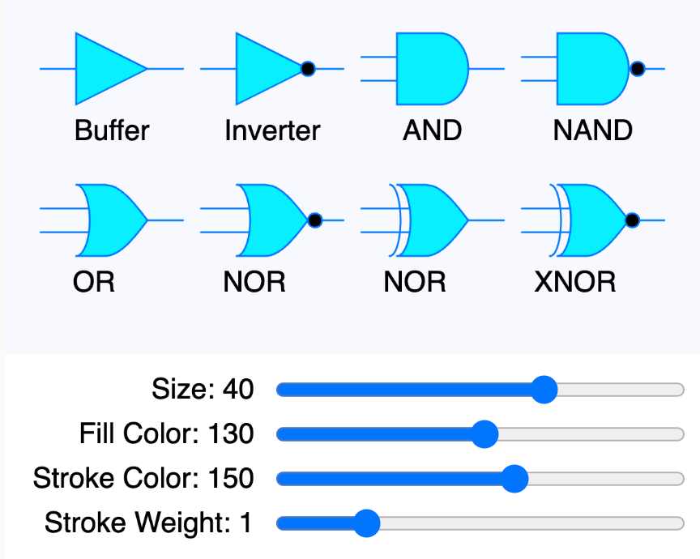

# Decomposition of Drawing Digital Logic Gates



[Go to the MicroSim Page](../sims/logic-gates/index.md)

## Logic Gate Example

Imagine the following prompt:

```linenums="0"
Create a p5.js library of functions to draw all the logic gate
symbols in digital circuit design.
```

This is a hard problem to tackle in a single prompt/response pair.
But we can ask GPT-4 to draw a single logic gate and then use that as a template to do successive logic gates.  Here is a [sample dialog](https://chat.openai.com/g/g-yLEKOCjXP-p5-js-visual-art-composer/c/2870503f-06d6-4a7f-9189-e59c7747f023) of this with GPT-4 and using the [p5.js custom GPT tool](https://chat.openai.com/g/g-yLEKOCjXP-p5-js-visual-art-composer).

There are a few things to note in this dialog.  It went well for the simple diagrams like buffer (just a triangle) and inverter.  But it totally failed to generate the correct math for the curves on the OR gates.
To do this I had to manually help it write the code for the equations
that draw the curves correctly.  But once the first OR curves were
done the NOR, XOR and XNOR were trivial for GPT-4 to render.

## Your Assignment

There are two steps to this assignment.  

### Step 1 Use GPT to Suggest a Simulation

Tell GPT-4 that you are an instructor of a high school or college course.
Tell GPT-4 that you have recently found a tool that makes it very easy
to build interactive simulations that have input controls such as buttons
and sliders.  Ask GPT-4 to suggest what are the most difficult concepts
to learn in this course, and rank them by the probability that a
small simulation could explain the concept better.

**Example:**

```linenums="0"
I am a college profession teaching analog-circuits course.
I recently found a tool that makes it very easy
to build interactive simulations where the users
can control the simulation parameters using buttons
and sliders.  What are the most difficult topics
to explain in an undergraduate course in analog
circuits?  Please list them and order the results
based on the probability that I can create an
interactive simulation to explain the concept.
```

## Step 2: Use Decomposition

Suggest that for a given problem, you will ask GPT to divide
the simulation into a series of functions.  Then ask GPT
to generate the function as well as test the function.
Copy the functions into a library that can be used by
the next pass at the problem.

Please take careful notes during this assignment, noting
what things GPT did well and what things it failed at.
Note how you overcame some of the problems.

When you are done, check your code into GitHub and be
prepared to demo the program using the p5.js editor.

## Sample Solutions

[Decomposition for Analog Circuits](./02a-decomposition-analog.md)

[Decomposition for Signals and Systems](./02b-decomposition-signals-and-systems.md)