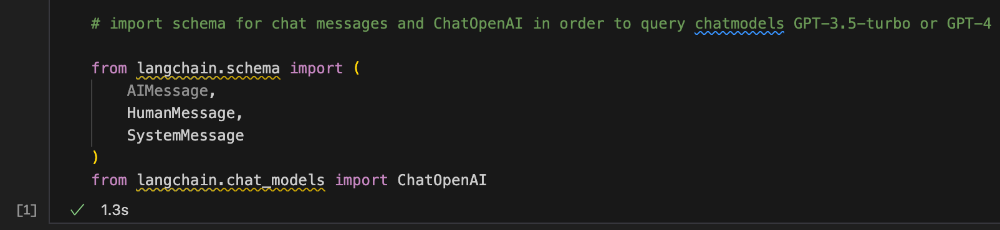
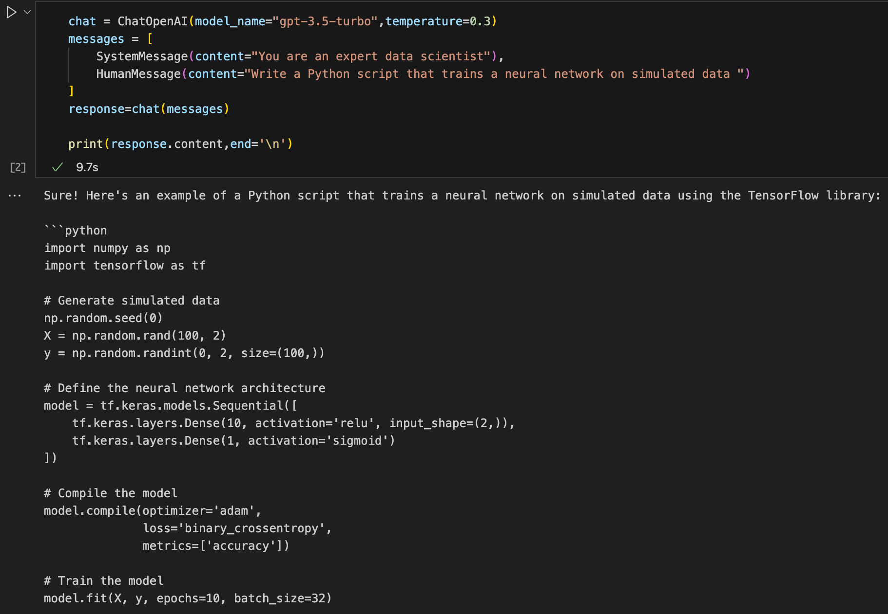
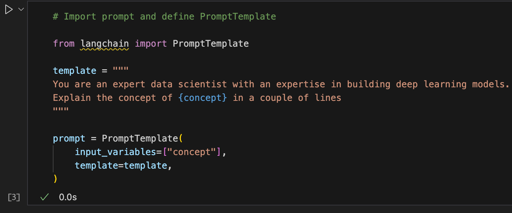
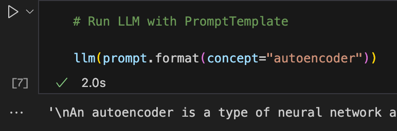

# Jupyter Notebook

Here are some samples of using the LangChain APIs.

## Load Environment Variables

```py
# Load environment variables

from dotenv import load_dotenv,find_dotenv
load_dotenv(find_dotenv())
```



## Run Basic Query

```py
# Run basic query with OpenAI wrapper

from langchain.llms import OpenAI
llm = OpenAI(model_name="text-davinci-003")
llm("explain large language models in one sentence")
```


## Run LangChain Imports

```py
# import schema for chat messages and ChatOpenAI in order to query chatmodels GPT-3.5-turbo or GPT-4

from langchain.schema import (
    AIMessage,
    HumanMessage,
    SystemMessage
)
from langchain.chat_models import ChatOpenAI
```


## Have GPT generate Python Code

In this example, we combine the System Message with the Human Message.
The API will concatenate them together and send it to OpenAI.

```py
chat = ChatOpenAI(model_name="gpt-3.5-turbo",temperature=0.3)
messages = [
    SystemMessage(content="You are an expert data scientist"),
    HumanMessage(content="Write a Python script that trains a neural network on simulated data ")
]
response=chat(messages)

print(response.content,end='\n')
```



## Import Prompts


## Run With Prompt Template



## Use LangChain to Build a Prompt Only Response Pipeline

```py
# Import LLMChain and define chain with language model and prompt as arguments.

from langchain.chains import LLMChain
chain = LLMChain(llm=llm, prompt=prompt)

# Run the chain only specifying the input variable.
print(chain.run("autoencoder"))
```

## Sequential Chain

Here we put two components together to form a chain.  The output of ```chain``` is fed into ```chain_two```

```py
# Define a sequential chain using the two chains above: the second chain takes the output of the first chain as input

from langchain.chains import SimpleSequentialChain
overall_chain = SimpleSequentialChain(chains=[chain, chain_two], verbose=True)

# Run the chain specifying only the input variable for the first chain.
explanation = overall_chain.run("autoencoder")
print(explanation)
```