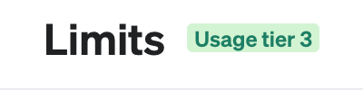
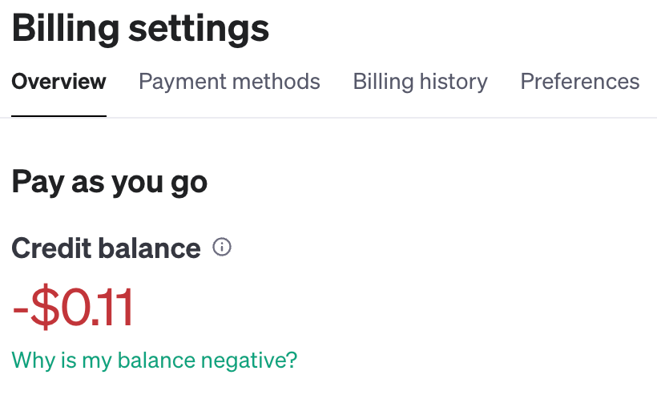
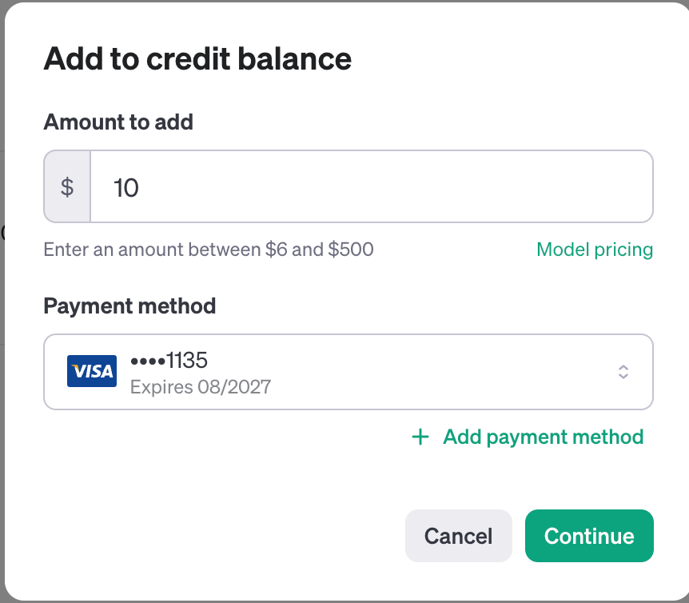
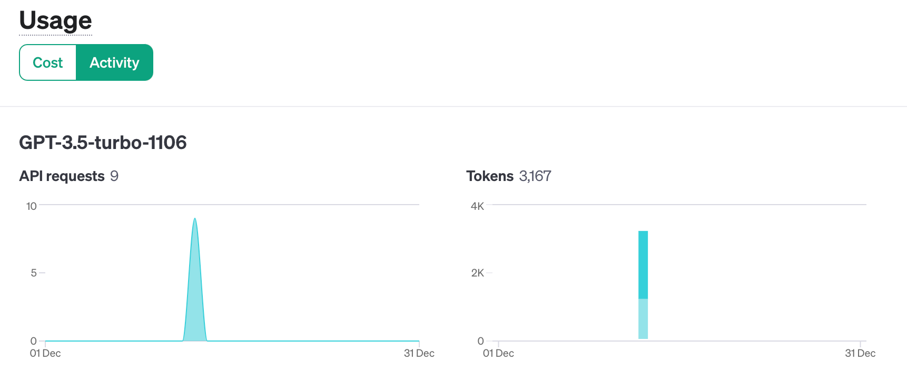

# OpenAI Rate Limits

If you get the OpenAI 429 error:

```linenums="0"
raise self._make_status_error_from_response(err.response) from None
openai.RateLimitError: Error code: 429 - {'error': {'message': 'You exceeded your current quota, please check your plan and billing details. For more information on this error, read the docs: https://platform.openai.com/docs/guides/error-codes/api-errors.', 'type': 'insufficient_quota', 'param': None, 'code': 'insufficient_quota'}}
```

You can see what Tier you are on here:

[Account Tier Limits](https://platform.openai.com/account/limits)







