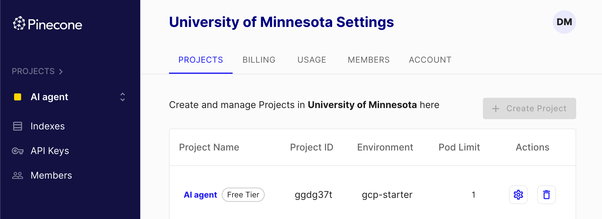

# Pinecone

Free Tier:

Limited to one index and one project.
Community Support Only

## Environment Settings

Make sure to put .env in your .gitignore file to
make sure that you don't put this fine on GitHub

```sh
PINECONE_ENV="..."
PINECONE_API_KEY="..."
```

The free version uses the Google Cloud Platform:

```sh
OPENAI_API_KEY="..."
PINECONE_API_KEY="..."
PINECONE_ENV="gcp-starter"
```

## Pinecone Project



## Pinecone AI Agent API Key

