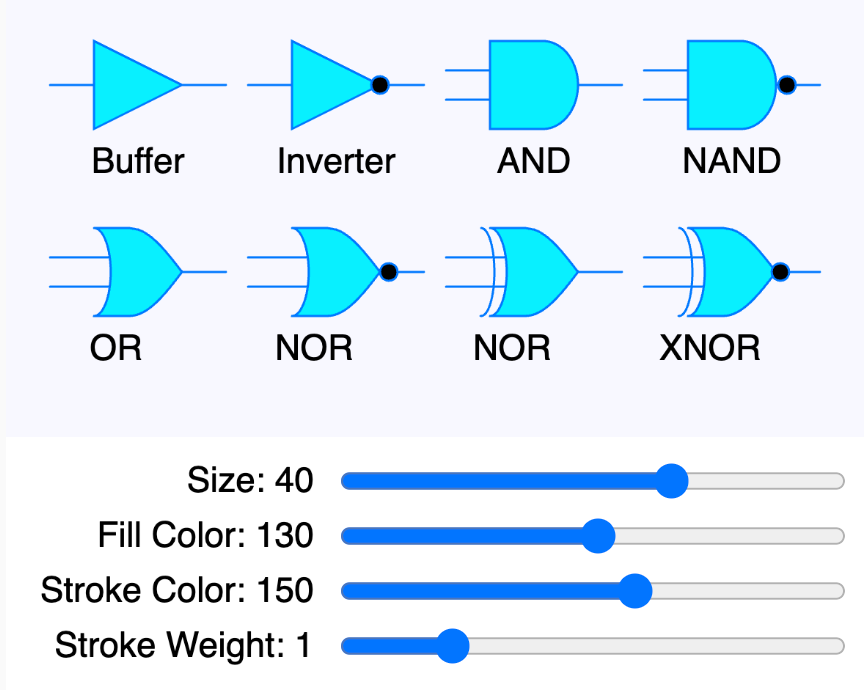

# Logic Gate Drawing Library

{ width="400" }

This is our attempt to generate a logic gate drawing library
that can be used to build a full logic simulator.

[Logic Gates Main Test MicroSim](logic-gates.html){ .md-button .md-button--primary }
[Edit the Logic Gate Library Test MicroSim](https://editor.p5js.org/dmccreary/sketches/SpFEWepWj)

[Buffer, Inverter, AND, NAND](https://chat.openai.com/g/g-yLEKOCjXP-p5-js-visual-art-composer/c/2870503f-06d6-4a7f-9189-e59c7747f023)

[OR, NOR, XOR, XNOR](https://chat.openai.com/g/g-yLEKOCjXP-p5-js-visual-art-composer/c/7b5c561a-f61a-47b8-9cf8-81defa2762d9)

The full library is [here](./logic-gate-lib.js).