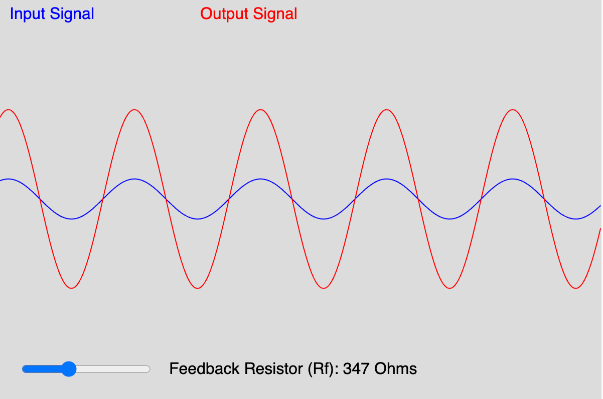
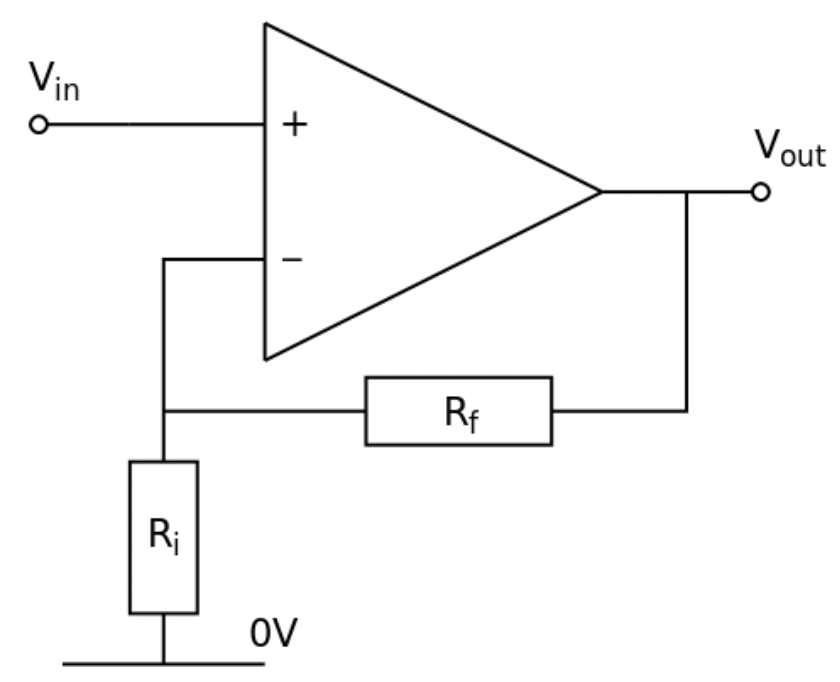

# Non-inverting Op-Amp

{ width="400" }

[Link to the Non-Inverting Op-Amp Demo](op-amp.html){ .md-button .md-button--primary }

[Edit the Non-Inverting Op-Amp](https://editor.p5js.org/dmccreary/sketches/cOPZi_hjF)

## About This MicroSim

